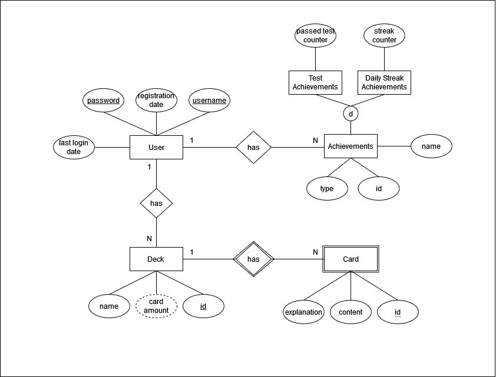
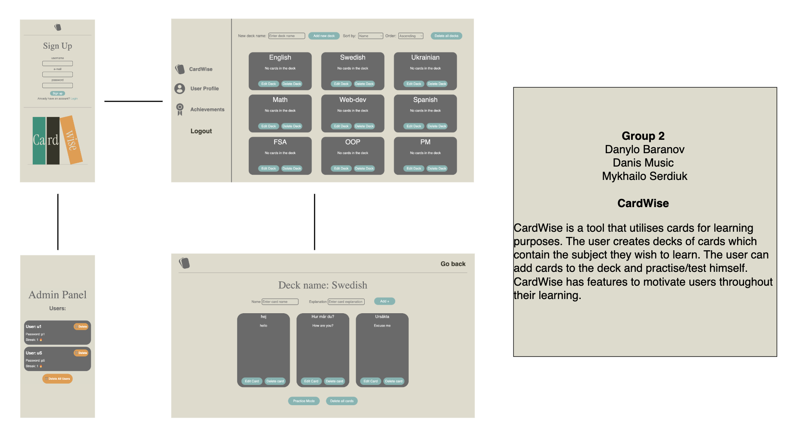

# Backend and Frontend Template

Latest version: https://git.chalmers.se/courses/dit342/group-00-web

This template refers to itself as `group-00-web`. In your project, use your group number in place of `00`.

## Project Structure

| File        | Purpose           | What you do?  |
| ------------- | ------------- | ----- |
| `server/` | Backend server code | All your server code |
| [server/README.md](server/README.md) | Everything about the server | **READ ME** carefully! |
| `client/` | Frontend client code | All your client code |
| [client/README.md](client/README.md) | Everything about the client | **READ ME** carefully! |
| [docs/LOCAL_DEPLOYMENT.md](docs/LOCAL_DEPLOYMENT.md) | Local production deployment | Deploy your app local in production mode |

## Requirements

The version numbers in brackets indicate the tested versions but feel free to use more recent versions.
You can also use alternative tools if you know how to configure them (e.g., Firefox instead of Chrome).

* [Git](https://git-scm.com/) (v2) => [installation instructions](https://www.atlassian.com/git/tutorials/install-git)
  * [Add your Git username and set your email](https://docs.gitlab.com/ce/gitlab-basics/start-using-git.html#add-your-git-username-and-set-your-email)
    * `git config --global user.name "YOUR_USERNAME"` => check `git config --global user.name`
    * `git config --global user.email "email@example.com"` => check `git config --global user.email`
  * > **Windows users**: We recommend to use the [Git Bash](https://www.atlassian.com/git/tutorials/git-bash) shell from your Git installation or the Bash shell from the [Windows Subsystem for Linux](https://docs.microsoft.com/en-us/windows/wsl/install-win10) to run all shell commands for this project.
* [Chalmers GitLab](https://git.chalmers.se/) => Login with your **Chalmers CID** choosing "Sign in with" **Chalmers Login**. (contact [support@chalmers.se](mailto:support@chalmers.se) if you don't have one)
  * DIT342 course group: https://git.chalmers.se/courses/dit342
  * [Setup SSH key with Gitlab](https://docs.gitlab.com/ee/ssh/)
    * Create an SSH key pair `ssh-keygen -t ed25519 -C "email@example.com"` (skip if you already have one)
    * Add your public SSH key to your Gitlab profile under https://git.chalmers.se/profile/keys
    * Make sure the email you use to commit is registered under https://git.chalmers.se/profile/emails
  * Checkout the [Backend-Frontend](https://git.chalmers.se/courses/dit342/group-00-web) template `git clone git@git.chalmers.se:courses/dit342/group-00-web.git`
* [Server Requirements](./server/README.md#Requirements)
* [Client Requirements](./client/README.md#Requirements)

## Getting started

```bash
# Clone repository
git clone git@git.chalmers.se:courses/dit342/group-00-web.git

# Change into the directory
cd group-00-web

# Setup backend
cd server && npm install
npm run dev

# Setup frontend
cd client && npm install
npm run serve
```

> Check out the detailed instructions for [backend](./server/README.md) and [frontend](./client/README.md).

## Visual Studio Code (VSCode)

Open the `server` and `client` in separate VSCode workspaces or open the combined [backend-frontend.code-workspace](./backend-frontend.code-workspace). Otherwise, workspace-specific settings don't work properly.

## Advanced Functionality Proposal
During the development of this project, we realized that a notification system would be ideal for the purpose of the flashcard system. Since the system is supposed to promote learning we thought this would be a perfect way to ensure that the user of the system would be reminded to, for example, practice their new deck!

This is why we wanted to use Nodemailer together with our custom date-keeping system, which will change the Nodemailer intances to fit the users needs. 


#### Frontend
The frontend aspect of this feature will be located in the user profile. This is where the user can configure their email notifcation settings. They will for example be able to decive when during the day the email will be sent, how many times per day and what kind of notifications they should be (reminding them to practice, notify them if they have an empty deck etc). 

#### Backend
In the backend Nodemailers inbuilt methods for creating emails will be used aswell as its functionality for sending emails to multiple different email providers. We have the email of the user saved in the database, which will be utilized when searching for a specific user id for sending a notification. The configurations saved from the frontend will be sent back to the backend through an endpoint with the user id as the route parameter. This information will together with the email that the user has will be used in the date-keeping system where it will use the configuration to edit the email instance. If the user has assigned a different email then the system will change the Nodemailer object instnace to that email through a patch endpoint. If the user changed when their email should be sent, then the date-keeping system will also change the necessary configurations in the Nodemailer instance to fit the specified changes brought from the frontend.

## System Definition (MS0)

### Purpose

CardWise is a tool that utilises cards for learning purposes. The user creates decks of cards which contain the subject they wish to learn. The user can add cards to the deck and practise/test himself. CardWise has features to motivate users throughout their learning.

### Pages

**Registration page** - User enters their username and password to create an account for future usage of the tool.


**Login page** - User enters their username and password to get access to the rest of the application.


**Profile page** - Displays the logged in users account information, overall statistic of the account (online daily streak, amount of decks, account registration date).


**Homepage** - Shows the carddecks that the user has created aswell as a navigation bar on the left hand side of the computer screen and at the top for the mobile version. The navigation bar can navigate to the profile page. Users can add or delete decks on this page.


**Card deck page** - Shows all the cards in the deck aswell as buttons for starting a practice round or starting a test. It has buttons for creating and deleting cards. It also shows the users current progression of the deck as a percentage.


### Entity-Relationship (ER) Diagram



## Teaser (MS3)


